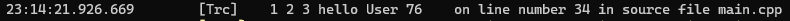
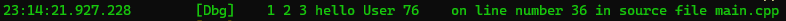
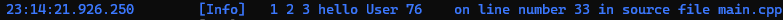
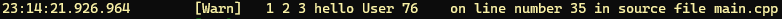
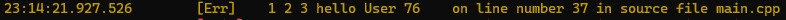
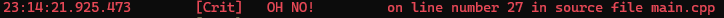
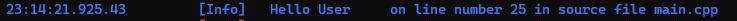

# loggerlib

An easy to use, stb-style header only logging library for both Windows and Linux. Now supports color!

## Build Instructions

1. `#include` the `logger.hpp` file in your C/C++ project.
2. Define `LOGGING` in your build environment to enable logging. Removing this variable will strip out all the logging code so you can have a log free release build.
3. Optionally, define `LOGCOLOR` in your build environment to enable colors for different log levels.

## Usage Instructions

### Priority Levels

loggerlib has 6 different levels in the following precedence order (from least important to most important):

1. Trace (Light gray)
   
2. Debug (Green)
   
3. Info (Blue)
   
4. Warn (Yellow)
   
5. Error (Orange)
   
6. Critical (Red)
   

You can set the logger's output level by calling
`LOGGER_PRIORITY(PRIORITY_ENUM_HERE);`
The logger's priority level will make it ignore printing all the logs below the current priority level.

For eg. `LOGGER_PRIORITY(Logger::Priority::WARN);`
will ignore all logs of the priority level below warn (info, debug, trace)

####Priority Enum values
`Logger::Priority::TRACE`
`Logger::Priority::DEBUG`
`Logger::Priority::INFO`
`Logger::Priority::WARN`
`Logger::Priority::ERR`
`Logger::Priority::CRITICAL`

### Print format

You can set what bits of information the logger prints by calling:
`LOGGER_FORMAT({ Logger::TIME | Logger::LEVEL | Logger::STRING | Logger::LINE });`
Here `Logger::TIME`, `LEVEL`, `STRING`, `LINE` are OR'd together to set a bitfield which defines the logger format state.

Since we defined the time, level, string and line fields to be active, our output for:
`LOG_CRITICAL("OH NO!");`
will be

where we can see the timestamp, the log level, the string passed in, and the line number printed.

#### Format values

`Logger::TIME`
`Logger::LEVEL`
`Logger::STRING`
`Logger::LINE`
`Logger::FILE` (WIP file writing)

Please note that the format and priority state is `thread_local` so different threads can output different kinds of logs.

### Calling Syntax

loggerlib supports printf style formatting:
`const char* name = "User"`
`LOG_INFO("Hello %s", name);`
prints

loggerlib also supports comma separated style formatting:
`CLOG_DEBUG(1, 2, 3, "hello", name, 76);`
prints

#### Macros for printf style

`LOG_TRACE(FormatString, ...)`
`LOG_DEBUG(FormatString, ...)`
`LOG_INFO(FormatString, ...)`
`LOG_WARN(FormatString, ...)`
`LOG_ERROR(FormatString, ...)`
`LOG_CRITICAL(FormatString, ...)`

#### Macros for comma separated style

`CLOG_TRACE(Comma separated params)`
`CLOG_DEBUG(Comma separated params)`
`CLOG_INFO(Comma separated params)`
`CLOG_WARN(Comma separated params)`
`CLOG_ERROR(Comma separated params)`
`CLOG_CRITICAL(Comma separated params)`
